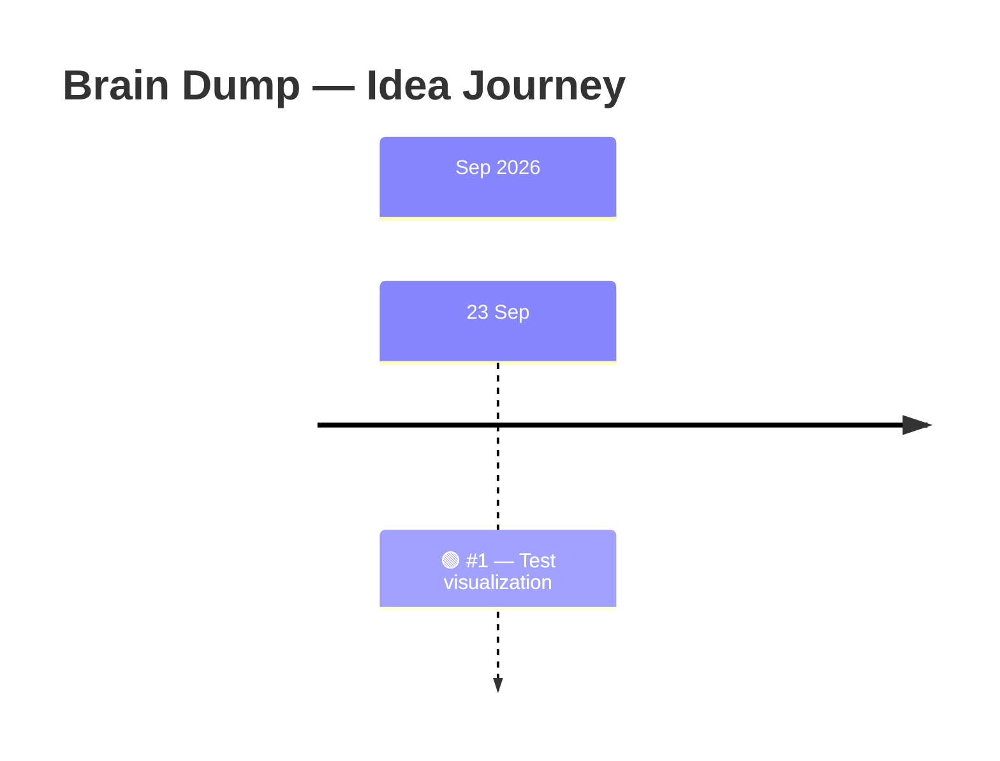

# 🧠 Brain Dump

### Capture now. Decide later.

A lightweight home for thoughts, sparks, and half-formed concepts before they become real projects.

**One idea = one GitHub Issue.**

---

## ⚡ Quick actions

| ✍️ Capture | 💡 Browse | 🧭 Roadmap | 🕒 History |
| --- | --- | --- | --- |
| **[New idea](https://github.com/afnannuzulasugihartono/brain-dump/issues/new/choose)** | **[All ideas](https://github.com/afnannuzulasugihartono/brain-dump/issues)** | **[Brain Dump project](https://github.com/users/afnannuzulasugihartono/projects/1/views/1)** | **[Full timeline](TIMELINE.md)** |

> **Principle:** capture first. Organize later. Build only when an idea is ready.

---

<!-- TIMELINE:START -->
## 📊 Snapshot

| 💡 Total ideas | 🟢 Open | ✅ Closed | 🕒 Latest capture |
| ---: | ---: | ---: | --- |
| 1 | 1 | 0 | 23 Sep 2026 |

## ✨ Latest spark

**[#1 — Test visualization](https://github.com/afnannuzulasugihartono/brain-dump/issues/1)**  
Captured **23 Sep 2026** · 🟢 Open

## 🗓️ Idea timeline

## 💭 Latest ideas

| Date | Idea | State |
| --- | --- | --- |
| 23 Sep 2026 | [#1 — Test visualization](https://github.com/afnannuzulasugihartono/brain-dump/issues/1) | 🟢 Open |
<!-- TIMELINE:END -->

The dashboard above is generated automatically from GitHub Issue timestamps. No manual date entry is required.

---

## 🌱 How ideas move

| 1. Capture | 2. Explore | 3. Promote | 4. Archive |
| --- | --- | --- | --- |
| Write it down before it disappears. | Add context only when useful. | Turn promising ideas into a real project/spec. | Close ideas that no longer matter. |

`Inbox → Exploring → Promising → Project → Archived`

Ideas are allowed to remain unfinished. Promotion is deliberate.

---

## 🧭 Source of truth

- **Created** — the original GitHub Issue creation timestamp.
- **Updated / Closed** — GitHub-native timestamps.
- **[TIMELINE.md](TIMELINE.md)** — complete chronological history.
- **[Brain Dump Project](https://github.com/users/afnannuzulasugihartono/projects/1/views/1)** — roadmap/project view.

<strong>🤖 Guidance for AI agents</strong>

 

Content in this repository is **brainstorming material**.

Do **not** treat an idea as an approved requirement, roadmap item, or implementation task unless it is explicitly promoted into a real project or spec.

