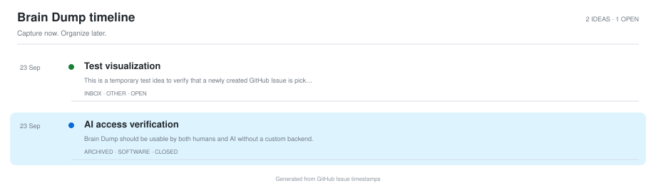

# 🕒 Brain Dump Timeline

Complete chronological history generated from original GitHub Issue creation timestamps.

  <picture>
    <source media="(prefers-color-scheme: dark)" srcset="./assets/idea-journey-dark.svg">
    <source media="(prefers-color-scheme: light)" srcset="./assets/idea-journey-light.svg">
    
  </picture>

_Last generated: 2026-09-23 06:41 UTC_

## 💭 All ideas

| Date | Idea | State |
| --- | --- | --- |
| 23 Sep 2026 | [#1 — Test visualization](https://github.com/afnannuzulasugihartono/brain-dump/issues/1) | 🟢 Open |

> Dates come directly from GitHub Issue creation timestamps; no separate capture-date field is required.
