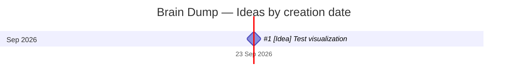

# Brain Dump Timeline

Automatically generated from the original GitHub Issue creation timestamps.

_Last generated: 2026-09-23 04:35 UTC_

## Ideas

| Date | Idea | State |
| --- | --- | --- |
| 2026-09-23 | [#1 [Idea] Test visualization](https://github.com/afnannuzulasugihartono/brain-dump/issues/1) | Open |

> The date shown here comes directly from the GitHub Issue creation timestamp, so no separate capture-date field is required.
